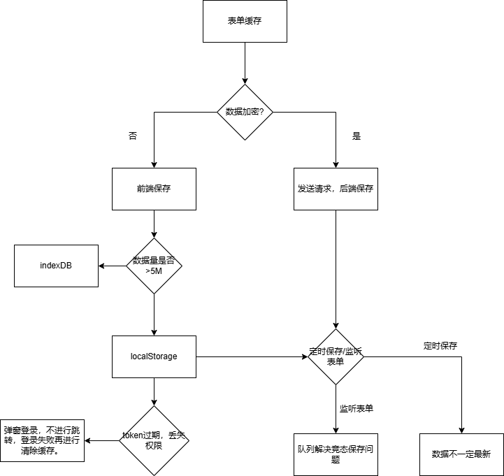

# 常见问题/功能

## axios

1. 页面跳转，请求未完成取消请求 Map<> 记录path 对应 请求数组。 初始化时，接受path，路由守卫监听跳转，请求拦截器 传入请求{ id ,controller }, 响应拦截器 清空已完成的请求

## Form

1. 传递data给Form组件，需要先deepClone 否则会导致数据共享问题 \
2. 嵌套对象数据渲染，采用递归自身组件/ 知道结构模板渲染 \
3. 表单提交流程：表单校验 -> 发送请求 -> 成功删除弹窗（失败提示或滚动到错误项） -> 请求刷新 \
4. 表单缓存/表单草稿， localStorage 定时/监听数据变化，记录刷新数据。\
   
5. 表单新旧数据对比，提示用户变化对比 \
6.

## Table

1. 表格+ 分页， 请求未返回时就跳转页（数据闪烁）  -> 添加通讯状态，v-show让未返回时，分页消失 / axios的AbortController 取消请求（singal）\
2. 表格 单选/多选 后用Form 展示详细信息

## echart

### 1. echart在resize()，title超出图表宽度处理

### 2. echart x,y轴name过长不显示

### 3.大数据渲染优化
